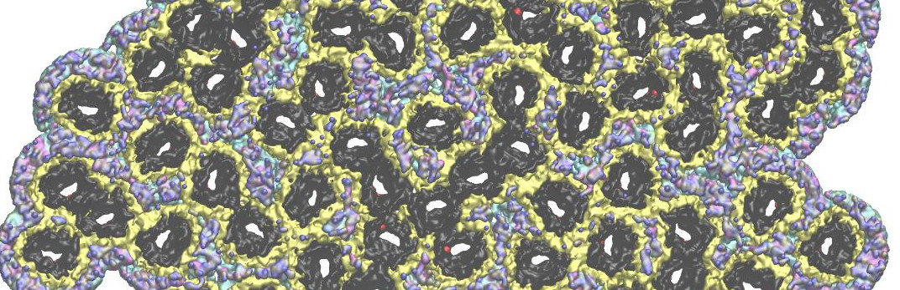

# Article Communication Biology 2025
## Lipids modulate the organization of VDAC1, the gatekeeper of mitochondria
V1 - preprint on [BioRXiv](https://www.biorxiv.org/content/10.1101/2024.06.26.597124v1)

VDACs, the most abundant proteins in the outer mitochondrial membrane (MOM), are crucial for mitochondrial physiology. VDAC regulate metabolite and ion exchange, modulate calcium homeostasis, and play roles in numerous cellular events such as apoptosis, mitochondrial DNA (mtDNA) release, and different diseases. Mitochondrial function is closely tied to VDAC oligomerization, influencing key processes like mtDNA release and apoptosis, but the molecular drivers of this oligomerization remain unclear. In this study, we investigate the effects of three major MOM lipids on VDAC assemblies using atomic force microscopy and molecular dynamics simulations. Our results show that phosphatidylethanolamine and cholesterol regulate VDAC assembly, with the formation of stable lipid-protein clusters of various size and compaction. Deviations from physiological lipid content disrupted native-like VDAC assemblies, highlighting the importance of lipid environment in VDAC organization. These findings underscore how lipid heterogeneity and changes in membranes influence VDAC function.

**Scripts list**
- [catAFM2CG](README.md#catAFM2CG) a python script to graft CG (MArtini) molecular dynamics simulations coordinates on picked Atomic Forces Microscopy coordinates
- [StatsOn-rdf](README.md#StatsOn-rdf)
- [clustOnAggreg](README.md#clustOnAggreg)

## Scripts ##

### catAFM2CG  : 
a python script to graft CG (Martini) molecular dynamics simulations coordinates on picked Atomic Forces Microscopy coordinates

V 0.97p (beta)
- The AFM coordinates are provide as a simple coord.dat, csv (blank or tab separated fields) containing x y z rot coordinate comming from AFM image peacking. Coordinates in &angst; rot is a relative orientation (deg) relative to a reference surface (see *infra*)
*A coord.dat Sample*
```   192.2	343.7	0.0	100
    205.0	403.3	0.0	229
    225.5	476.0	0.0	258
    238.3	377.4	0.0	21
    284.4	512.3	0.0	257
    289.5	439.7	0.0	34
    294.6	351.5	0.0	200
```
- A dedicated directory, referencend to the "path" argument contains Coarse Grained MARTINI cordinates in a GRO frormat (Gromacs).
- Other parameters define in the argument parser :
 
```
   #Arguments
    parser.add_argument('-i', '--prefix', type=str, default='sys', help='Name Préfix of individaul CG files stored in the "path" directory (default: "sys")')
    parser.add_argument('-p', '--path', type=str, default='./CGGrofiles', help='Path to the input "gro" files (défault: see code)')
    parser.add_argument('-n', '--n_prot', type=int, default=5, help='Protein number to proceed (défault: 5)')
    parser.add_argument('-t', '--rand', action="store_true" , help='True = Generate a random orientation instead of the rot provided in the coord.dat input file')
    parser.add_argument('-nm', '--nomin', action="store_false" , help='True = Search an optimumum rientation to minimize inter protein clashes')    
    parser.add_argument('-r', '--ref', type=int, default=158, help='Reference atome (index) on the CG coordinate to define the reference face for orientation (0 deg) (défaut: 158 - E72)')
    parser.add_argument('-d', '--dist', type=float, default=3.3, help='Distance for clashes consideration (default = 3.3)')
    parser.add_argument('-c', '--dcyl', type=float, default=50.0, help='Distance for cylinder radius to concerve lipids around proteins (default = 50 A)')
    parser.add_argument('-a', '--afmcoor', type=str, default='coord.dat',  help='AFM coordinate file use to map proteins in the AFM micrography (défaut: coord.dat)')
    parser.add_argument('-o', '--output', type=str, default='catCG2AFM.gro', help='Coordinate output file ("gro" ar "pdb", default: "catCG2AFM.gro")')
```
*Features*
- Use python multi-threads provided by the "multiprocessing" library
- Try a hierachical clutering analysis to aptimize processor loads (bigs still present)
- Suppress lipid overlaps (either to proteins or to previously positionned lipids)
- Perform a very basic protein-protein optimization procedure to limite clashes by protein rotation

*Bugs an todo things*
- The hierachical clusterization procedure sometime behave poorly giving rise to unresolved situation vith no convergence
- Allows small translations in the peeking error range to try to resolve additionnal claches
- Puts methods in a custum library directory
- Only for visualization and lipid/protein ration and partition analyses. Not direcly adapted to subsequent molecular simulations

### StatsOn-rdf
V 0.7
Analyzing a series of Radial Distribution Functions (RDFs) generated using a previously provided VMD script to extract statistics within aggregates. This analysis provides insights and graphical representations of the neighbor distributions of monomers. A key feature is the transformation of the RDF into population distributions, exploring the possibilities for grouping.

- The RDF files are stored in the specified -p path and are expected to match the naming pattern "*.dat".
- This path also contains a reference RDF file that stores the g(R) function computed for the entire aggregate.
- Both files consist of two columns, separated by a blank field, with a unique identifier in the header of the second column
  
```
Distance RDF_44
1.0 0.0
3.0 0.0
5.0 0.0
7.0 0.0
9.0 0.0
.../...
35.0 0.0
37.0 0.0
39.0 0.0
41.0 0.00021844605743717715
43.0 0.0001986016427024372
45.0 9.067165188554325e-5
47.0 0.0
```
- Other parameters define in the argument parser : 
```
   #Arguments
    parser = argparse.ArgumentParser(description='Analysis of g(R) files to characterize the heterogeneity within an oligomeric aggregate.')
    parser.add_argument('-p', '--path', type=str, default='./RDF',
                        help='Path to reach the individual RDF files')
    parser.add_argument('-d', '--distrange', type=str, default='47-49 51-55 57-61 63-67 69-79 81-85',
                        help='Distance ranges to group as a single bar (blank separated fields)')
    parser.add_argument('-s', '--size', type=int, default=100,
                        help='Number of patches to include in the statistical analysis')
    parser.add_argument('-sd', '--seed', type=int, default=1970,
                        help='Seed for the random selection of patches')
    return parser.parse_args()
```
*Bugs and todo things*

- The code asume that the distance increment in RDF is 2 Å  

### clustOnAggreg
Clustering particles within agregates using the [DBSCAN](https://scikit-learn.org/stable/modules/generated/sklearn.cluster.DBSCAN.html) algorithm.


V 2.2 
- The AFM coordinates are provided in a simple 'coord.dat' default named file, which is a CSV format (with fields separated by either spaces or tabs) containing x and y values in the first two columns. The previously used coord file for building models from AFM data is acceptable...
- DBSCAN primarily comprises two arguments: the minimum number of points required to consider an aggregate (set to 2 in this case) and a distance parameter that defines when points are considered to be in contact, known as the eps value. This eps value should be close to the diameter of the protein.

- Basic usage :

  python ./clustOnAggregV2.2.py  -i  coordNochol.txt --eps 53 -w 53 -c


- Other parameters define in the argument parser : 
```
   #Arguments
    parser = argparse.ArgumentParser(description='Clustering of particle within agregates using the DBSCAN algorithm ')
    parser.add_argument('--eps', type=float, default=DEFAULT_EPS, help='Maximum radius of particles to be considered in the neighborhood search.')
    parser.add_argument('--min_samples', type=int, default=DEFAULT_MIN_SAMPLES, help='Minimum size for a cluster.')
    parser.add_argument('-i', '--input_file', type=str, required=True, help='Path to the input file containing particle coordinates.')
    parser.add_argument('-o', '--output_file', type=str, help='Path to the output file for cluster indices.')
    parser.add_argument('-c', '--plot_clust', action='store_true', help='Whether to plot the cluster (False without switch).')
    parser.add_argument('-d', '--plot_dist', action='store_true', help='Whether to plot the distribution of clustering (False without switch).')
    parser.add_argument('-w', '--width', type=float, default=DEFAULT_DIAM, help='Protein width for ploting cluster (in A), eg. diameter')
    parser.add_argument('--colbyclust', action='store_true', help='Each cluster is colored with distinct colors rather than being represented by size')
    parser.add_argument('-s', '--seed', type=int, default=DEFAULT_SEED, help='Seed for color plot.')
    parser.add_argument('--cpng', type=str, help='Path to save the cluster plot as an image file.')
    parser.add_argument('--dpng', type=str, help='Path to save the distribution plot as an image file.')
```
*Features*

- The separation of monomers from the aggregate is essential to the DBSCAN algorithm, which does not try to cluster all points and instead classifies all non-clustered points as noise.
- An alternative color scheme is proposed: the default scheme colors aggregates based on their size, while the other scheme covers a range of hues, assigning a distinct color to each individual cluster.
- With the second scheme, the seed value change the color distribution between clusters

*Bugs, limits and todo things*

- The point size representing the protein size (width) — diameter given in angstroms (Å) — is determined based on the plot scale and a reference size for the scatter points. A seemingly unusual consequence of this method is that the protein surface relative to the field remains proportionally accurate, even if the scale of the coordinates is incorrect or modified (for instance, converting the ccordinate from Å to nm). This behavior can be confusing, as the eps parameter for the DBSCAN algorithm depends on the true dimensions of the coordinate system.

- The optimal value for the eps parameter corresponds to the upper values of the protein contact distance, as observed in the RDF function. This may be a consequence of the non-ideal cylindrical shape of the VDAC proteins used in the development.

